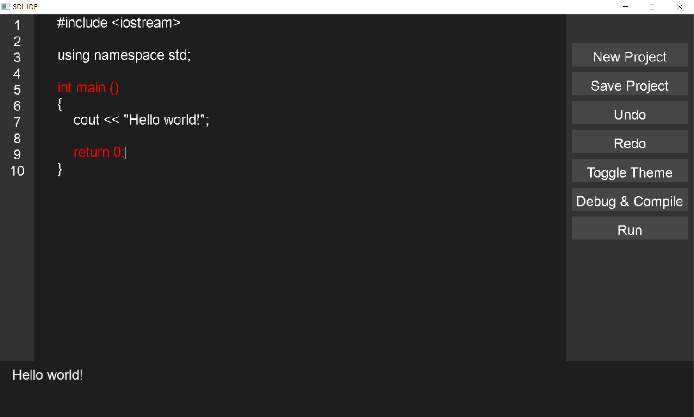
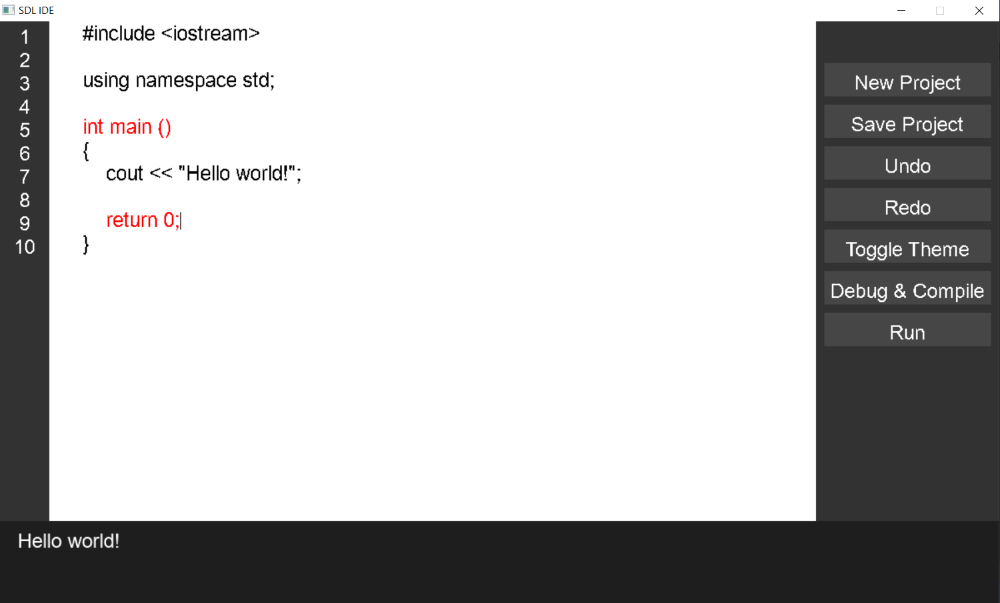

# SDL-Based Lightweight IDE  

A simple **Integrated Development Environment (IDE)** built using **C++, SDL2, and SDL2_ttf**. This lightweight IDE features syntax highlighting, a sidebar with useful actions, error reporting, and compilation features.


---

## Features 🎯

- 📝 **Text Editor** with basic editing capabilities
- 🎨 **Dark/Light Mode Toggle**
- 🔄 **Undo/Redo Support**
- 🔠 **Syntax Highlighting** (for keywords like `int`, `if`, `return`, etc.)
- 🖱 **Sidebar with Functional Buttons:**
  - **New Project**
  - **Save Project**
  - **Undo / Redo**
  - **Toggle Theme**
  - **Compile & Run**
  - **Debug**
- 🖥 **Integrated Compilation & Execution**
- 🛑 **Error Display Panel**
- ⌨️ **Keyboard Shortcuts:**
  - `Ctrl + S` → Save project
  - `Ctrl + O` → Open project
  - `Ctrl + Z` → Undo
  - `Ctrl + Y` → Redo
  - `Ctrl + X` → Cut
  - `Ctrl + C` → Copy
  - `Ctrl + V` → Paste
  - `Ctrl + A` → Select all
  - `Ctrl + B` → Compile & Run

---

## Releases 🚀
Find stable versions of this project in the **[Releases](https://github.com/ThePral/SDL-Based-Lightweight-IDE/releases)** tab.

- Download precompiled binaries
- View release notes and version history
- Access older versions if needed

---

## Installation 📥

### 1️⃣ Prerequisites 📦

Before compiling, ensure you have installed:

- **SDL2**
- **SDL2_ttf**
- **G++ (MinGW-w64 for Windows)**

### **Windows Setup**
Install **SDL2** & **SDL2_ttf**:
```sh
pacman -S mingw-w64-ucrt-x86_64-SDL2 mingw-w64-ucrt-x86_64-SDL2_ttf
```
Or manually download SDL2 from:
- [SDL2](https://github.com/libsdl-org/SDL/releases)
- [SDL2_ttf](https://github.com/libsdl-org/SDL_ttf/releases)

### **Linux Setup**
Install SDL2 & SDL2_ttf:
```sh
sudo apt install libsdl2-dev libsdl2-ttf-dev
```

### **Mac Setup**
Install via Homebrew:
```sh
brew install sdl2 sdl2_ttf
```

##

### 2️⃣ Clone the Repository 📂

```bash
git clone https://github.com/ThePral/SDL-Based-Lightweight-IDE.git
cd SDL-Based-Lightweight-IDE
```

##

### 3️⃣ Build & Run ⚙️

#### Windows  
```bash
g++ integrated_ide.cpp compile.cpp -o ide.exe -lSDL2 -lSDL2_ttf -Wall -Wextra -g
./ide.exe
```

#### Linux/macOS  
```bash
g++ integrated_ide.cpp compile.cpp -o ide -lSDL2 -lSDL2_ttf
./ide
```

## Debugging 🐞
If you encounter crashes, run the program in **GDB**:
```sh
gdb ide.exe
run
```

## Notes 📌
- Ensure **`arial.ttf`** is in the project folder.
- The compiled programs are stored in `temp_output.exe`.
- Errors & warnings appear in the **Error Panel**.

---

## Usage 🎮

1️⃣ **Edit your C++ code** in the editor.  
2️⃣ **Use sidebar buttons** to compile, run, or switch themes.  
3️⃣ **Check error panel** for compilation messages.  
4️⃣ **Use shortcuts** to speed up editing.  

---

## Screenshots 🖥️

| Dark Mode | Light Mode |
|-----------|-----------|
|  |  |

---

## Contributing 🛠️

Contributions are welcome! Feel free to:  
- **Fork the repo** and submit a PR.  
- **Report issues** in the [Issues](https://github.com/ThePral/SDL-Based-Lightweight-IDE/issues) tab.  

---

## License 📜

This project is licensed under the **MIT License**. Free to use & modify!
<br>
See [LICENSE](LICENSE) for details.  

---

